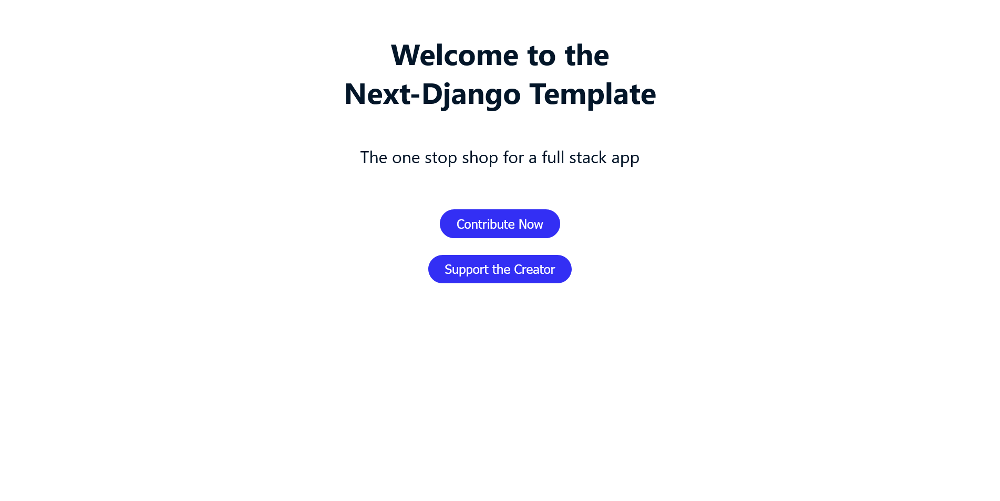

# Next.js-Django Template

 

Boilerplate for a Next.js Django app

## Requirements

- nvm
- node
- yarn
- Docker
- Docker-Compose
- Make
- next
- cypress

## Frontend

Next.js app with BEM SCSS using JS (TS is overkill for frontend and unit tests are meaningless till at least MVP)

See [next-django-template.test](http://next-django-template.test/) if you added to /etc/hosts (if you are on windows see Windows)

---

### Dependencies

To add dependencies, do `make frontend-add package=<named-of-package>`

### Development

To run development first install dependencies with `make install` then do `make run`

## Backend

See [api.next-django-template.test](api.next-django-template.test/) if you added to /etc/hosts (if you are on Windows you may also need to add aliases to C:\Windows\System32\drivers\etc\hosts)

Django backend with logger, email, unit tests

### Admin

If you want to make a superuser do `make createsuperuser` and that will create an admin with login credentials of the following:

Username: admin
Password: admin

---

### Add App

To add an app to the backend, do `make new-app app=<named-of-app>`

⚠ When starting a new app you might get errors inf they are not installed locally, in which case comment out dependencies in INSTALLED_APPS in `settings.py`

### Dependencies

To add dependencies, do `make backend-add package=<named-of-package>`

### Migrations

If you change or create model entities, you will need to generate migrations for the DB. Simply run `make migrations` or `make migrations name=migration-name app=app-name` for a named migration where app-name will corresponding to the app where the model was changed. If you do not do this, then your entity changes will not be reflected in the database.

## DevOps

Docker, Docker-compose, Makefiles, Traefik for proxy handling

To start off do `make init` or do `make up` if you are starting it up again

To bring the services down do `make down`

## Testing

Unit testing for backend and cypress testing for e2e. To run e2e do `make e2e` (unfortunately this does not work on WSL)

## TODOS

Here are a list of things you need to do once you decide to use this template

- change constants in frontend/components/constants/constants for front end defaults
- change .env.local to your personal settings
- Change traefik.yml and /etc/hosts for new alias domains
- Auth with JWT: [django-rest-framework-simplejwt.readthedocs.io/en/latest](https://django-rest-framework-simplejwt.readthedocs.io/en/latest/)
- Cron jobs for backend: [gutsytechster.wordpress.com/2019/06/24/how-to-setup-a-cron-job-in-django](https://gutsytechster.wordpress.com/2019/06/24/how-to-setup-a-cron-job-in-django/)

## Development Workflow

### Branches

Main should be the production env while dev branch is pre-production. Any other feature or bug can be added as a new branch in the format of project name followed by the ticket number (ie NDT-00401)

### PRs

PRs likewise should have project name followed by the ticket number and optionally include the epic it is a part of. In addition a description should be included

Example: NDT-00401(MVP): Finished frontend as part of the MVP

Where MVP is the current epic

### Support

With inspiration from [github.com/vintasoftware/django-react-boilerplate](https://github.com/vintasoftware/django-react-boilerplate)

## License

